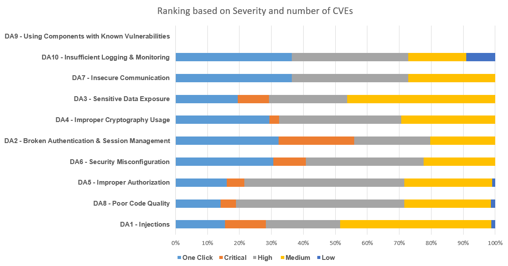

# 
# OWASP Top 10 Desktop Application Security Risks (2021) | Ranking based on severity and frequency of CVE
 

There are many CVEs identified that do not require user interaction and any privilege. Based on the number of CVEs found and severity of such issues, following is the ranking of OWASP Top 10 Desktop Application vulnerabilities.

Note: Let's call the Critical/High vulnerabilities with no prvilege requried and no user interaction as 'OneClick'.

| Category | One Click | Critical | High | Medium | Low |
|---|---|---|---|---|---|
| DA1 - Injections | 40 | 33 | 60 | 122 | 3 |
| DA8 - Poor Code Quality | 32 | 11 | 120 | 62 | 3 |
| DA5 - Improper Authorization | 32 | 11 | 100 | 55 | 2 |
| DA6 - Security Misconfiguration | 30 | 10 | 36 | 22 | 0 |
| DA2 - Broken Authentication & Session Management | 19 | 14 | 14 | 12 | 0 |
| DA4 - Improper Cryptography Usage | 10 | 1 | 13 | 10 | 0 |
| DA3 - Sensitive Data Exposure | 8 | 4 | 10 | 19 | 0 |
| DA7 - Insecure Communication | 4 | 0 | 4 | 3 | 0 |
| DA10 - Insufficient Logging & Monitoring | 4 | 0 | 4 | 2 | 1 |
| DA9 - Using Components with Known Vulnerabilities | 0 | 0 | 0 | 0 | 0 |
 

 
Note: 

1. This ranking is based on the data accumulated from CVEs by an automated process, having certain keywords and excluding certain keywords to assure tha the CVEs found are related to desktop applications.
2. Category 'DA9 - Using Components with Known Vulnerabilities' have zero matching CVEs in the above table, because all such vulnerabilities that include vulnerable components have their own CVEs assigned to them, that are matching to other categories.
   
The data accumated is of year 2023 till August 12th.
